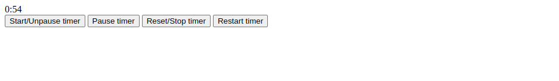

# Interval - Js class for advanced countdown timer.

Using this library you can create countdown for a specific task to happen, like for sms, otp an demail verifications, and live chats etc.

```js
const interval = new Interval({
    counter: '#counter',
    delay: 1000,
    duration: 1,
    onStart: function () {
        console.log('When started the interval');
    },
    onEnd: function () {

        console.log('When ended the interval');
    },
    onPaused: function () {

        console.log('When paused the interval');
    },
    onReset: function () {

        console.log('When reseted the interval');
    },
    onRestart: function () {

        console.log('When restarted the interval');
    }
});
```



## Properties

You can update or read these property values.

### counter : property

This defines the targeted element you want to update the content.

class : '.count'

id : '#count'

tagname : 'div'

```js
interval.counter;
```

### delay : property

Defines the refresh rate of the `setInterval` method.

```js
interval.delay;
```

### duration : property

Defines how long you want to run the function. This should be in `seconds`. But by few modifications you can convert it to seconds, mili-seconds or hours etc.

```js
interval.duration;
```

## Options

### onStart : option

You can run any actions when the `setInterval started`.

### onEnd : option

You can run any actions when the `setInterval ends` due to timeout.

### onPaused : option

You can run any actions when the `setInterval is paused`.

### onReset : option

You can run any actions when the `setInterval is reset`. This will bring the countdown to `initial` time. But it won't start the countdown.

### onRestart : option

You can run any actions when the `setInterval is restarted`.

## Methods

### start : method

Start the timer function. But the initial `0:0` won't be shown.

```js
interval.start();
```

### pause : method

Pause the timer function.

```js
interval.pause();
```

### reset : method

Reset the timer function. It will output the `0:0` initially.

```js
interval.reset();
```

### restart : method

Restart the timer function.

```js
interval.restart();
```

Thank you, @Kenura R.Gunarathna.